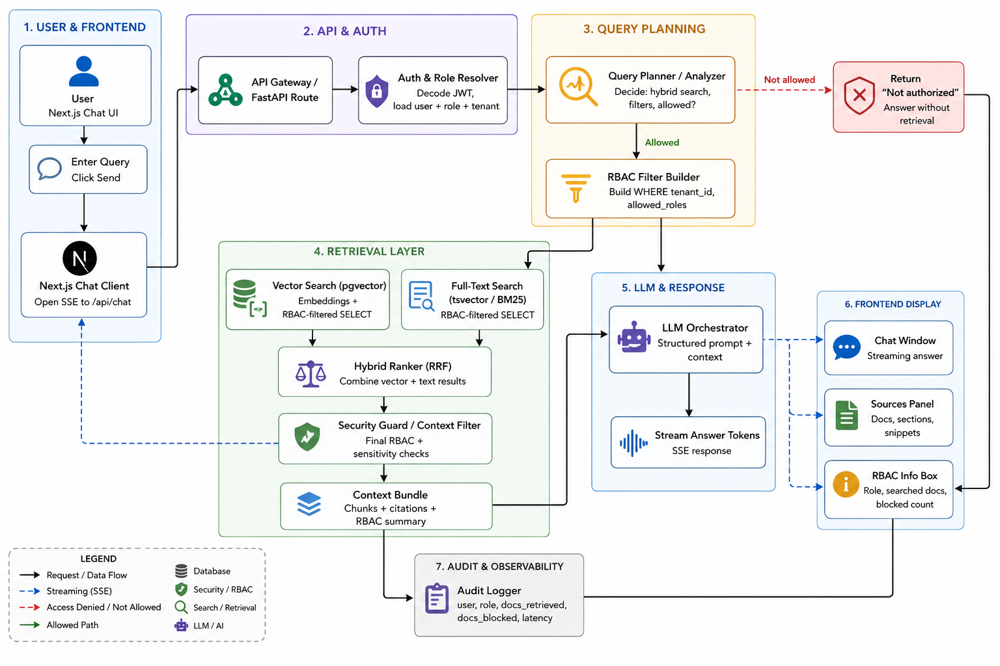

# Agentic RAG with RBAC

A secure internal document assistant that lets different roles (HR, finance, legal, engineering, etc.) safely query company documents using RAG, with SQL-level role-based access control (RBAC) enforced before retrieval.

Instead of a basic "vector search + LLM" demo, this project focuses on **authorization-first retrieval**: every query is checked against the user's role and document permissions before any embeddings or RAG steps run, so sensitive data never leaks across roles.

---

## 1. What This Project Does

- Provides a chat-style interface for querying internal PDFs and documents.
- Uses a retrieval-augmented generation (RAG) pipeline to find relevant chunks.
- Enforces RBAC at the database layer so each role only sees authorized content.
- Adds a planning layer inspired by agentic RAG ideas to decide:
  - Whether a query is allowed.
  - Which documents and retrieval strategy to use.
  - How to assemble context for the LLM.

This makes it closer to an enterprise document intelligence platform than a simple RAG toy.

---

## 2. Problem Statement

Modern companies have thousands of sensitive internal documents: HR policies, payroll spreadsheets, legal contracts, engineering designs, financial reports, and more. Everyone wants a ChatGPT-like interface for these documents, but:

- Not every employee should see every document.
- Most RAG demos ignore authorization and treat all data as globally visible.
- A single misconfigured system can leak salaries, legal disputes, or strategy docs to the wrong people.

This project solves **secure RAG with strict RBAC**:

> "Users can ask natural-language questions over internal documents, but the system checks their role and document permissions before retrieving or exposing any content."

---

## 3. High-Level Architecture

At a high level, the system works like this:

1. **User & Auth**  
   - Users log in and are assigned roles (e.g., `admin`, `hr`, `finance`, `engineering`).
   - Auth uses JWT or session-based authentication.

2. **Planning & RBAC Guardrails**  
   - A planning layer inspects the query and user role.
   - It decides whether the query is allowed, and if so, which document set to search.
   - If the query is not allowed, it returns a safe refusal message and logs the attempt.

3. **Retrieval**  
   - Authorized documents are chunked and stored with embeddings in Postgres + pgvector.
   - Hybrid search combines dense vector search with full-text search, filtered by RBAC rules at the SQL level.

4. **LLM Answering**  
   - Relevant chunks + query + conversation history are sent to a local LLM via Ollama.
   - The model generates a grounded answer citing the source documents.

5. **Observability & Audit**  
   - Every query, allowed/denied decision, and document access is logged for audit.
   - This creates a trail of who saw what and why.

> In short: **RAG with "authorization first, retrieval second"**.

---

## 4. Tech Stack

This project is intentionally built with tools that are friendly to local development and junior DevOps roles:

- **Frontend + API**: Next.js (App Router, `app/api/...` routes)
- **Database**: PostgreSQL + pgvector (embeddings + RBAC metadata)
- **ORM**: Prisma (schema management and migrations)
- **LLM Runtime**: Ollama (local open-source models, no external API cost) [cite:8]
- **Caching & Rate Limiting (future)**: Redis [cite:11]
- **Containerization (future)**: Docker
- **Orchestration (future)**: Kubernetes + Helm + ArgoCD GitOps
- **CI/CD (future)**: GitHub Actions (build, test, push Docker image)

---

## 5. Current Status & Roadmap

### Current Status

- Requirements and architecture are defined.
- Core schema for users, roles, documents, permissions, chunks, and audit logs is planned.
- Local, free LLM setup via Ollama is chosen as the runtime.

### Next Steps

1. Initialize Next.js project and basic routes:
   - `/login`, `/chat`, `/admin/upload`.
2. Set up PostgreSQL and Prisma:
   - Define models for `User`, `Role`, `Document`, `DocumentPermission`, `Chunk`, `AuditLog`.
3. Install and configure Ollama:
   - Pull a small instruct model for answering.
   - Pull an embedding model for retrieval.
4. Implement the first feature:
   - Simple authenticated chat that logs queries (even before full RBAC is wired).

Later enhancements:

- RBAC-aware retrieval and refusal flow.
- Rate limiting and session memory via Redis.
- Dockerization, Kubernetes deployment, and GitOps with ArgoCD.
- Better UI/UX for document management and audit dashboards.

---

## 6. Why This Project Matters

For recruiters and hiring managers, this project demonstrates:

- Understanding of **secure RAG**, not just basic LLM usage.
- Ability to model RBAC at the database level rather than only in application code.
- Familiarity with local LLM runtimes (Ollama) and cost-aware design.
- Readiness to extend into full DevOps: Docker, Kubernetes, Helm, ArgoCD, CI/CD.

For you, it is a practical playground to combine:

- Full-stack Next.js work.
- Database design and Prisma.
- LLM integration.
- DevOps concepts.

---

## 7. How to Use This README

- As a **project overview** on GitHub.
- As a **context header** for LLMs when asking implementation questions:
  - e.g., "Using the above project, write a Prisma schema for RBAC and chunks."
- As a **talking point** in interviews:
  - Be ready to explain the RBAC guardrails, pgvector usage, and why Ollama is used locally.
